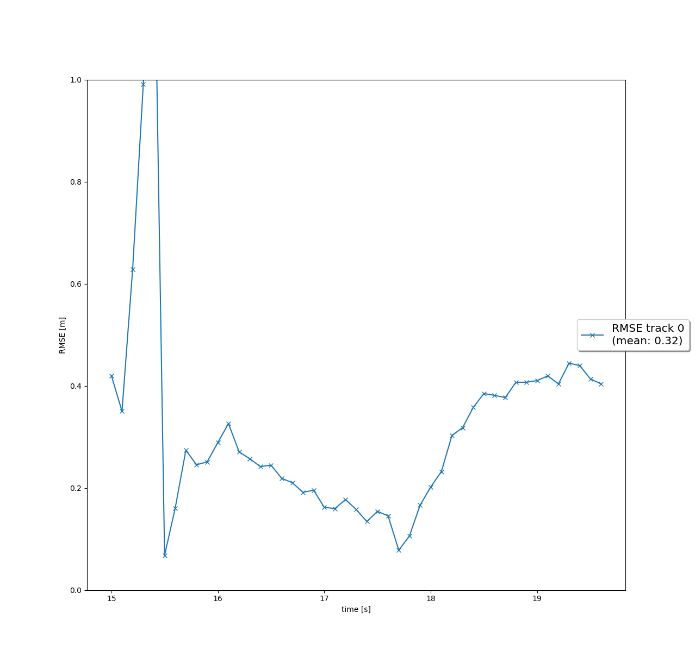
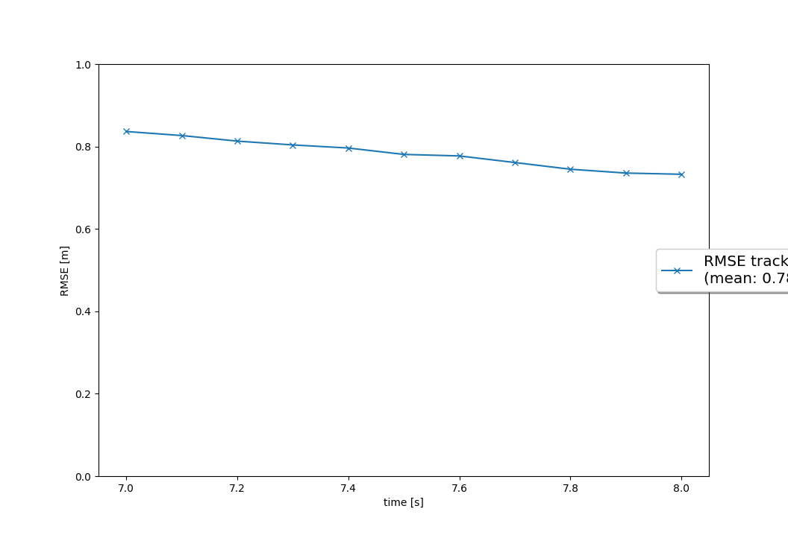
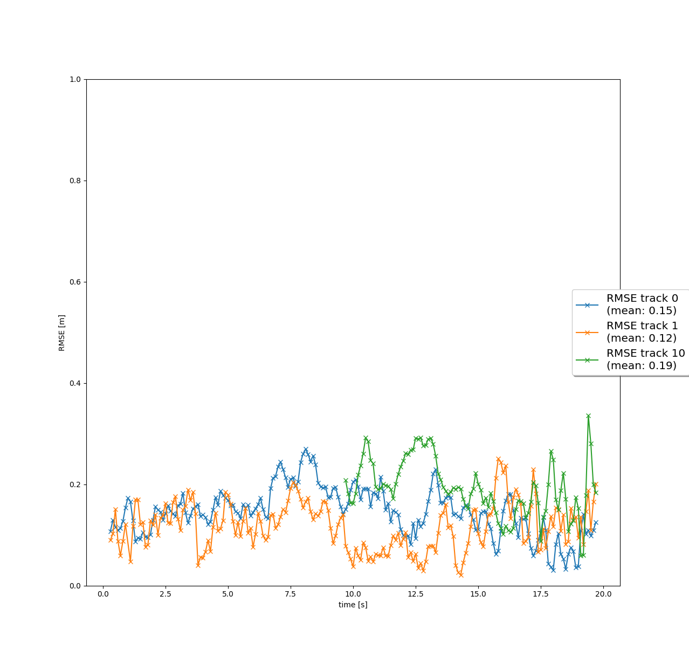
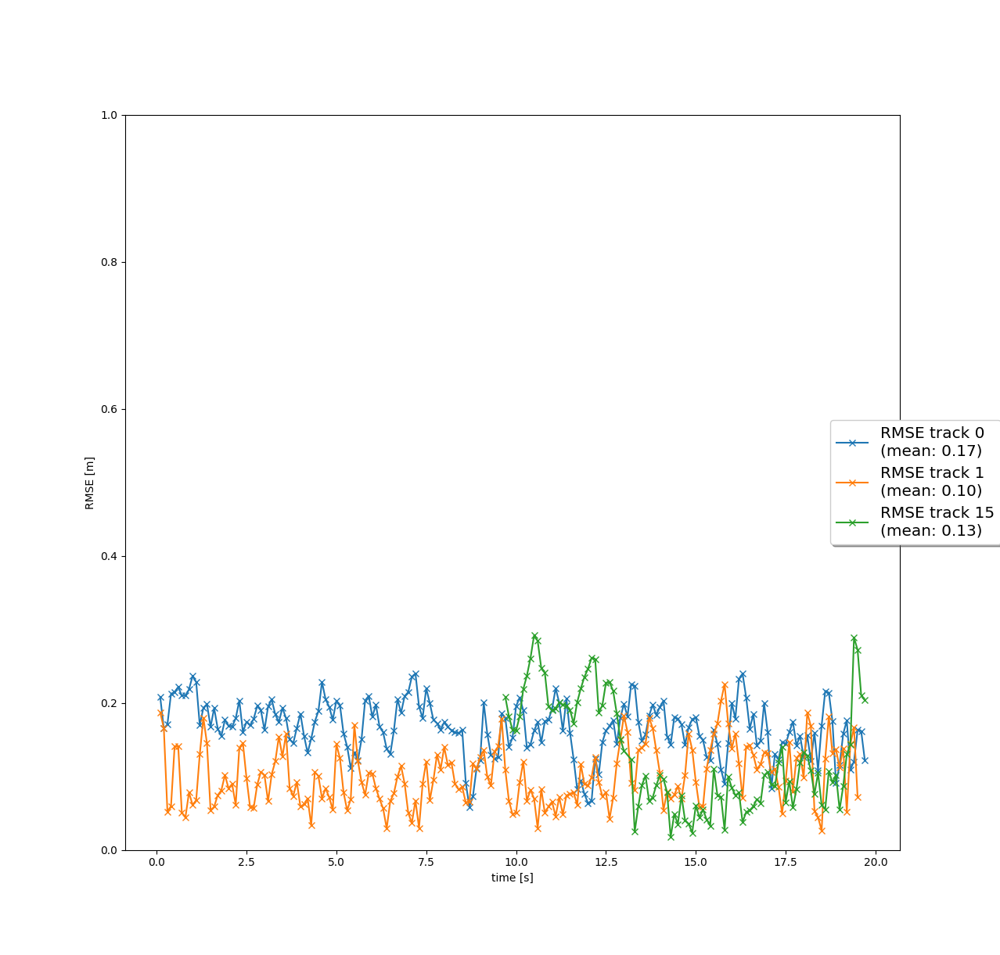

# Writeup: Track 3D-Objects Over Time

Please use this starter template to answer the following questions:

### 1. Write a short recap of the four tracking steps and what you implemented there (filter, track management, association, camera fusion). Which results did you achieve? Which part of the project was most difficult for you to complete, and why?

In step 1 I implemented the prediction and update equations of the Kalman Filter, and more specifically an Extended Kalman Filter (EKF). The filter uses a system model based on taylor series expansion of nonlinear system dynamics to predict the object's future state, and linearized measurements to update the estimate. In this step, the filter used only LIDAR measurements.

In step 2, I implemented logic to initialize and delete tracks, and to update the state and score of existing tracks. The track management module maintains a list of active tracks, creates new tracks for objects that are not yet tracked, confirms tracks that have already been initialized and receive new measurements, and finally deletes tracks that fall below a certain score (i.e. do not receive the necessary measurements).

In step 3, I implemented the single nearest neighbor data association algorithm to associate measurements to tracks based on their Mahalanobis distance. The data association module assigns measurements to tracks, creates new tracks for unassigned measurements, and updates the list of unassigned tracks and measurements.

In step 4, I implemented a nonlinear camera measurement model and a fusion algorithm to combine measurements from the camera and lidar sensors. In this step, data from both the camera and lidar sensors are fused to improve the tracking performance. The resulting performance is given below and shows the improvement.

### 2. Do you see any benefits in camera-lidar fusion compared to lidar-only tracking (in theory and in your concrete results)? 

Cameras provide (currently) much higher visual information about the object which can help in more accurate tracking. They provide semantic information quickly. Lidar sensors - even in adverse conditions - provide precise position and velocity state measurements. Fusing both combines these strengths, so that I know not only what I am following, but its exact position and speed.

### 3. Which challenges will a sensor fusion system face in real-life scenarios? Did you see any of these challenges in the project?

In real-life scenarios, a sensor fusion system suffer from noise,  sensor failure, calibration errors, and occlusions. It can also suffer from functional failures in its computational components. I definitely noticed occlusions being present, and some jumpiness due to sensor noise, especially in yaw.

### 4. Can you think of ways to improve your tracking results in the future?

To improve the tracking results in the future, some possible ways are:

Going in order of the steps:

Improve Sensor Fusion: Use more sophisticated sensor fusion algorithms that were mentioned in the course, such as unscented Kalman filter or particle filter. A UKF in particular doesn't depend on linearizing the system, but can thus handle nonlinear systems better, while not requiring as much tuning. On that note, I could have taken the time to tune my parameters.

Tracking: Implement a system that handles occlusions better.

Association: Implemented more advanced data association algorithms like GNN or JPDA. 

Camera-Lidar Fusion: Better performance on the actual machine learned models, as well as ensuring they are robust to weather and lighting changes.